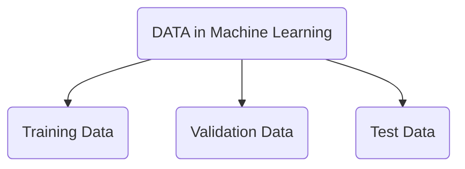

#MachineLearning 

>[!Reference]
>https://www.geeksforgeeks.org/ml-introduction-data-machine-learning/

本文轉譯自上述網址
## 以下為中文翻譯
數據在機器學習領域中是一個關鍵的組件。它指的是可以用來訓練機器學習模型的觀察或測量的集合。用於訓練和測試的數據的質量和數量在確定機器學習模型的性能中起著重要的作用。數據可以是各種形式，如數值、分類或時序數據，並且可以來自各種源，如數據庫、電子表格或API。機器學習算法使用數據來學習輸入變量和目標輸出之間的模式和關係，然後可以用於預測或分類任務。

數據通常分為兩種類型：

> 1. 有標籤的數據
> 2. 無標籤的數據

有標籤的數據包括**模型試圖預測的標籤或目標變量**，而無標籤的數據則**不包括標籤或目標變量**。用於機器學習的數據通常是**數值型**或**分類型**。數值數據包括**可以排序**和**測量的值**，例如年齡或收入。分類數據包括代表分類的值，例如性別或水果類型。

數據可以分為**訓練集和測試集**。==訓練集用於訓練模型，測試集用於評估模型的性能。==確保數據以**隨機**和代表性的方式分割是非常重要的。 數據預處理是機器學習流程中的一個重要步驟。此步驟可能包括**清理**和**正規化數據**、**處理缺失值**和**特徵選擇或工程**。

**數據：** 它可以是任何未經處理的事實、值、文本、聲音或圖片，這些都還未被解釋和分析。數據是所有數據分析、機器學習和人工智能的最重要部分。沒有數據，我們就不能訓練任何模型，所有現代研究和自動化都將付諸東流。大企業花費大量金錢僅僅是為了收集盡可能多的確定的數據。

**例如：** 為什麼Facebook以190億美元的高價收購WhatsApp？

答案非常簡單和邏輯：那就是為了獲得Facebook可能沒有，但WhatsApp會有的用戶信息。這些關於他們用戶的信息對Facebook來說是至關重要的，因為它將促進他們服務的改進。

**信息：** 已被解釋和操作的數據，現在對用戶有了一些有意義的推斷。

**知識：** 推斷信息、經驗、學習和見解的組合。結果在個人或組織中形成意識或概念建設。


在機器學習中，我們如何**分割數據**？

**訓練數據 (Training Data)：** 我們用來訓練模型的數據部分。這是模型實際看到的數據（輸入和輸出）並從中學習。

**驗證數據 (Validation Data)：** 這部分的數據用於頻繁地評估模型，==該模型是基於訓練數據集進行擬合的==，並在模型實際訓練時改進涉及的超參數（模型開始學習之前初次設定的參數）。

**測試數據 (Testing Data)：** 當我們的模型==完全訓練完成==後，測試數據提供了一個無偏的評估。當我們輸入測試數據的輸入時，我們的模型會預測一些值（而不查看實際輸出）。預測後，我們通過將其與測試數據中的實際輸出進行比較來評估我們的模型。這就是我們評估並看到我們的模型從訓練數據中獲得的經驗中學到了多少，這些經驗在訓練時被設定。

在實際應用中，數據的分割方式可能會因情況和需求而異。但通常，訓練數據占總數據的大部分，而驗證和測試數據則占較小的部分。例如，常見的分割比例為80%的訓練數據、10%的驗證數據和10%的測試數據，但這完全取決於具體情況。



考慮以下例子：

有一位購物商場老闆進行了一項調查，他問了顧客很多問題並獲得了答案，這份問題和答案的列表就是 **“數據”(DATA)** 。每次他想得出某些結論，卻不能逐一查看數千名顧客的每一個問題以找到相關資訊，因為這會耗時且沒有幫助。為了減少這種不必要的時間浪費並使工作更容易，通過軟件、計算、圖形等根據自己的方便對數據進行操作，從操作過的數據中得出的結論就是 **“信息”(Information)** 。因此，==數據是獲得信息的必要條件。==而 **“知識”(Knowledge)** 在於區分擁有相同信息的兩個人。知識其實不是技術內容，而是與人的思維過程相關。

數據的不同形式：

1. **數值數據 (Numeric Data)**：如果一個特徵表示用數字測量的特性，則稱為數值特徵。
2. **類別數據 (Categorical Data)**：類別特徵是可以基於某些質的特性取得的有限的，通常是固定數量的可能值的屬性。類別特徵也稱為名義特徵。
3. **序數數據 (Ordinal Data)**：這表示名義變量的類別按有序列表排序。例如，小、中、大的服裝尺寸，或者從“完全不滿意”到“非常滿意”的顧客滿意度測量。

數據的特性：

1. **體積 (Volume)**：數據的規模。
2. **多樣性 (Variety)**：不同形式的數據 - 醫療、圖像、視頻、音頻片段。
3. **速度 (Velocity)**：數據流和生成的速度。
4. **價值 (Value)**：研究者可以從中推斷的數據的信息意義。
5. **真實性 (Veracity)**：我們正在處理的數據的確定性和正確性。
6. **可行性 (Viability)**：數據用於不同系統和過程的能力。
7. **安全性 (Security)**：為防止數據遭受未經授權的訪問或操作而採取的措施。
8. **可訪問性 (Accessibility)**：獲取和使用數據進行決策的便利性。
9. **完整性 (Integrity)**：數據在其整個生命週期中的準確性和完整性。
10. **可用性 (Usability)**：數據對最終用戶的使用和解釋性的便利性。

關於數據的一些事實：

與2005年相比，到2020年將產生300倍，即40 Zettabytes（1ZB = 10^21字節）的數據。
到2011年，醫療部門擁有1610億Gigabytes的數據。
每天大約有2億活躍用戶發送4億條推文。
每月，用戶進行超過40億小時的視頻流。
每月用戶分享300億種不同類型的內容。
報告指出，大約27%的數據是不准確的，因此三分之一的商業理想家或領導者不信任他們所做決策的信息。

上述事實只是實際存在的龐大數據統計的一瞥。當我們在現實世界情境中談論時，目前存在的數據大小並且每一刻都在生成的數據是超出我們的想像範疇。

例子：

假設你在一家汽車製造公司工作，你想建立一個模型，==可以根據汽車的重量和引擎大小來預測汽車的燃油效率。==在這種情況下，目標變量（或標籤）是燃油效率，而特徵（或輸入變量）是重量和引擎大小。你會從不同的汽車型號中收集數據，並有相對應的重量和引擎大小，以及他們的燃油效率。這些數據是**有標籤的** ，對於每輛汽車，它的形式是(重量,引擎大小,燃油效率)。有了這些數據後，你將其分為兩組：訓練集和測試集，**訓練集用於訓練模型**，而**測試集用於評估模型的性能**。==可能需要預處理，例如填充缺失值或處理可能影響模型準確度的異常值。==

實施：
在這部分，您將具體描述如何使用上述數據來實施您的解決方案或項目。這可能包括數據收集、數據清理、特徵工程、模型選擇、模型訓練和模型評估等步驟。具體的技術、算法或工具的選擇也會在這部分進行說明。
```Python
# Example input data
from sklearn.linear_model import LogisticRegression
X = [[1, 2], [2, 3], [3, 4], [4, 5], [5, 6]]
y = [0, 0, 1, 1, 1]

# Train a model
model = LogisticRegression()
model.fit(X, y)

# Make a prediction
prediction = model.predict([[6, 7]])[0]
print(prediction)

```
**Output:**
```
0 or 1
```
如果您運行以上提供的代碼，**輸出將是模型所做的預測。** 在這種情況下，**預測將是0或1** ，==取決於模型在訓練期間學到的特定參數。==

例如，如果模型學到輸入數據中第二個元素較大時更有可能標記為1，那麼對於`[6, 7]` 的預測將是1。

### **優點**或**缺點**：
使用數據進行機器學習的優點：
1. 提高準確性：有大量數據，機器學習算法可以學習輸入和輸出之間更複雜的關係，從而提高預測和分類的準確性。
2. 自動化：機器學習模型可以自動化決策過程，比人類更有效準確地執行重複性任務。
3. 個性化：通過使用數據，機器學習算法可以為個別用戶個性化體驗，從而提高用戶滿意度。
4. 節省成本：通過機器學習進行自動化可以減少企業的人工需求，提高效率從而節省成本。
使用數據進行機器學習的缺點：
1. 偏見：用於訓練機器學習模型的數據可能存在偏見，導致偏見預測和分類。
2. 隱私：收集和存儲機器學習數據可能引起隱私擔憂，如果數據未得到適當保護，可能會帶來安全風險。
3. 數據質量：用於訓練機器學習模型的數據質量對模型的性能至關重要。質量不佳的數據可能導致不準確的預測和分類。
4. 解釋力不足：某些機器學習模型可能很復雜且難以解釋，這使得理解它們的決策方式變得具有挑戰性。
### 機器學習的應用：

機器學習是一個強大的工具，可以應用於各種領域。以下是一些最常見的機器學習應用：
1. 預測建模：機器學習可用於構建預測模型，根據歷史數據預測未來結果。這可以應用於股市預測、詐騙檢測、天氣預測和客戶行為預測等眾多應用中。
2. 圖像識別：機器學習可用於訓練模型，識別圖像中的對象、人臉和其他模式。這在許多應用中都有使用，如自駕車、人臉識別系統和醫學圖像分析。
3. 自然語言處理：機器學習可用於分析和理解自然語言，這在許多應用中都有使用，如聊天機器人、語音助手和情感分析。
4. 推薦系統：機器學習可用於構建推薦系統，根據用戶的過去行為或偏好推薦產品、服務或內容。
5. 數據分析：機器學習可用於分析大型數據集，識別人類難以檢測到的模式和見解。
6. 機器人技術：機器學習可用於訓練機器人自主執行任務，如在空間中導航或操作物品。
使用數據於機器學習中的**問題：** 

1. 數據質量：使用數據進行機器學習的最大問題之一是確保數據準確、完整且代表問題領域。質量低劣的數據可能導致模型不準確或有偏見。
2. 數據量：在某些情況下，**可能沒有足夠的數據** 可用於訓練準確的機器學習模型。尤其對於需要大量數據才能準確捕捉所有相關模式和關係的複雜問題而言，情況尤為如此。
3. 偏見與公平性：如果訓練數據存在偏見或不具代表性，機器學習模型有時可能延續偏見和歧視。這可能導致某些人群（如少數族裔或女性）獲得不公平的結果。
4. 過度擬合和欠擬合：**過度擬合是指模型過於複雜**，與訓練數據過於緊密匹配，從而導致對新數據的**泛化**能力不足。欠擬合則是指模型過於簡單，無法捕捉數據中的所有相關模式。
5. 隱私和安全：機器學習模型有時可以用於推斷有關個人或組織的敏感信息，引發有關隱私和安全的擔憂。
6. 可解釋性：某些機器學習模型（如深度神經網絡）可能很難解釋和理解，這使得解釋其預測和決策背後的推理變得具有挑戰性。