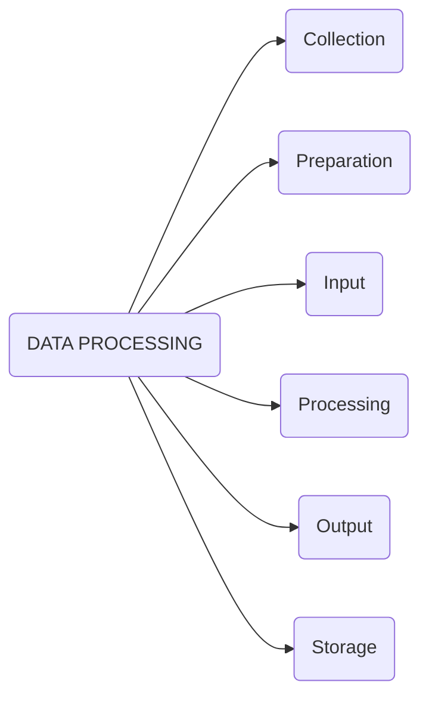

>[!Reference]
>https://www.geeksforgeeks.org/ml-understanding-data-processing/?ref=lbp

本文轉譯自上述網址
## 以下為中文翻譯

資料處理是==將資料從給定的形式轉換成更可用且更有意義的形式的任務==，即使其**變得更具信息和含義**。利用機器學習演算法、數學建模和統計知識，**整個過程可以自動化**。這個完整過程的輸出可以是任何所需的形式，例如圖形、影片、圖表、表格、圖像等，取決於我們正在執行的任務和機器的需求。這可能看起來很簡單，但當涉及像 Twitter、Facebook 這樣的大型組織，以及議會、聯合國教科文組織和衛生部門等行政機構時，整個過程需要以非常有結構的方式進行。因此，執行的步驟如下：

資料處理是機器學習（ML）流程中至關重要的一步，因為它準備了用於構建和訓練 ML 模型的資料。資料處理的目標是將資料進行清理、轉換和準備，使其適合進行建模。

資料處理通常涉及的主要步驟包括：

1. 資料收集：這是**從各種來源**收集資料的過程，例如傳感器、資料庫或其他系統。資料可以是結構化或非結構化的，並且可以以文本、圖像或音訊等各種格式呈現。

2. 資料預處理：這一步涉及對資料進行清理、過濾和轉換，以使其適合進一步分析。這可能包括刪除缺失值、對資料進行縮放或歸一化，或將其轉換為不同的格式。

3. 資料分析：在這一步中，使用各種技術進行資料分析，如統計分析、機器學習演算法或資料視覺化。**此步驟的目標是從資料中獲得見解或知識。**

4. 資料解釋：這一步涉及解釋資料分析的結果，並根據所獲見解得出結論。這可能還涉及以清晰簡明的方式呈現發現，例如通過報告、儀表板或其他可視化方式。

5. 資料存儲和管理：一旦資料經過處理和分析，就必須以安全且易於訪問的方式進行存儲和管理。這可能涉及將資料存儲在資料庫、雲存儲或其他系統中，並實施備份和恢復策略以防止資料丟失。

6. 資料視覺化和報告：最後，將資料分析的結果以易於理解和可操作的形式呈現給利益相關者。這可能涉及創建突顯資料中關鍵發現和趨勢的視覺化、報告或儀表板。

在機器學習的資料處理中，有許多工具和庫可用，包括 Python 的 pandas 和 RapidMiner 中的資料轉換和清理工具。工具的選擇將取決於項目的具體要求，包括資料的大小和複雜性，以及所需的結果。

#### 資料收集：
在開始機器學習時，最關鍵的步驟之一是擁有質量良好且準確的資料。資料可以從任何經過驗證的來源收集，如 data.gov.in、Kaggle 或 UCI 資料集存儲庫。例如，準備參加競爭性考試時，學生會從他們能夠獲取的最佳學習材料中學習，以便他們學得更好，獲得最佳成績。同樣，高質量和準確的資料將使模型的學習過程更加輕鬆和優越，並且在測試時，模型將產生最先進的結果。
在收集資料時需要耗費大量資本、時間和資源。組織或研究人員必須決定他們需要哪種類型的資料來執行任務或研究。
例子：在臉部表情識別器上工作需要大量具有各種人類表情的圖像。良好的資料確保模型的結果是有效的並且可以信任的。

#### 準備：
收集到的資料可能是原始形式，無法直接餵給機器。因此，這是從不同來源收集數據集，分析這些數據集，然後構建新的數據集進行進一步的處理和探索的過程。這個準備可以手動執行，也可以從自動方法執行。數據也可以以數值形式準備，這將加速模型的學習。
例子：圖像可以轉換為 N * N 維度的矩陣，每個單元格的值將指示圖像像素。

#### 輸入：
現在準備好的資料可能是無法被機器讀取的形式，因此需要一些轉換演算法將這些資料轉換為可讀取的形式。執行這個任務需要高計算能力和準確性。
例子：可以通過來源（如MNIST數字資料（圖像）、Twitter評論、音頻文件、視頻剪輯）來收集資料。

#### 處理：
這是需要算法和機器學習技術以準確和最佳計算方式對大量資料執行提供的指令的階段。

#### 輸出：
在這個階段，機器以容易被用戶理解的有意義的方式獲得結果。輸出可以是報告、圖表、影片等形式。

#### 儲存：
這是最後一步，將獲得的輸出和資料模型資料以及所有有用的資訊保存供將來使用。

#### 資料處理在機器學習中的優點：
提高模型性能：資料處理有助於通過清理和轉換資料成為適合建模的格式來提高ML模型的性能。
更好地呈現資料：資料處理允許將資料轉換為更好地呈現資料中底層關係和模式的格式，這使得ML模型更容易從資料中學習。
提高準確性：資料處理有助於確保資料準確、一致且無誤，這有助於提高ML模型的準確性。

#### 資料處理在機器學習中的缺點：
耗時：資料處理可能是一個耗時的任務，尤其對於大型和複雜的數據集而言。
容易出錯：資料處理可能存在錯誤，因為它涉及對資料進行轉換和清理，這可能導致丟失重要信息或引入新的錯誤。
對資料的理解有限：資料處理可能導致對資料的理解有限，因為轉換後的資料可能不代表資料中底層的關係和模式。
