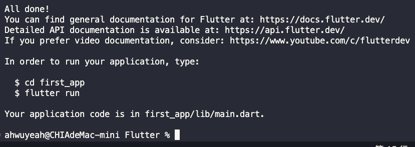
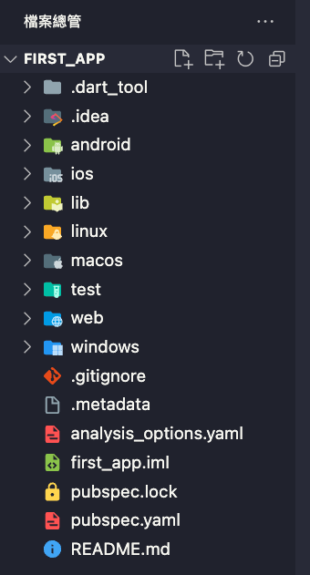
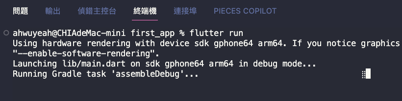
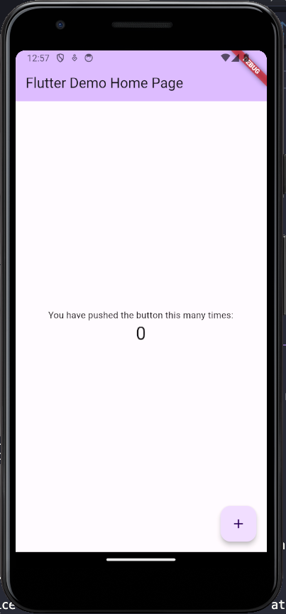
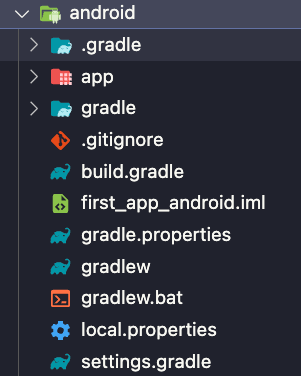

### 從[0.Flutter學習第1天-環境建立.md](0.Flutter學習第1天-環境建立.md)可以了解到以下安裝Flutter過程：
    1. 如何使用Git來管理Flutter SDK
    2. 設置命令行並保存路徑變量
    3. 使用Flutter Doctor診斷您的環境

### 可以開始建立Flutter Project了
1. 當確定好Flutter安裝好後，請打開VSCode並安裝Flutter與Dart的延伸套件。
2. 重啟VSCode，在終端機介面指定到`要建立Flutter的資料夾底下`，輸入`flutter creat first_app`
3. 如果創立成功後在你該資料夾底下應有一個名字叫做`first_app`的資料夾。
   
   

4. 使用VSCode開啟該資料夾。
5. 在`檔案總管欄`可以看到目前檔案內容的架構。

    

6. 請打開`lib`此資料夾，找到`main.dart`
7. 按下右上模擬器可以打開之前安裝的Android模擬器（請注意右下角，開啟的模擬器是Android還是windows
    
    
    
8. 如果是windows要重開
9. 如果是Android
    
10. 開啟後請回到終端機，然後輸入`flutter run`，會開始編譯
11. 會在模擬器上看到以下畫面

---

### Flutter檔案結構
從VSCode檔案總管欄位可以看到有許多資料夾，由於Flutter可支援linux, windows, macos, android, ios, web因此在左側的檔案夾內可以發現這些支援的資料夾，裡面內容主要包含`若要在該介面運行時的相關參數設定`
例如以下是Android的資料夾內容：

> [!warning]
> 不要將build資料夾上傳至公開github，由於裡頭會有包含你的隱私資料，而build資料夾是在執行flutter run之後所產生的執行檔案，因此會將隱私資料一起編譯進執行檔裡頭，若上傳至公開伺服器恐產生資料外洩問題。

- lib文件夾是Flutter應用程序的核心。您將在此處放置所有的Dart代碼。當項目第一次創建時，此目錄中只有一個文件：main.dart。由於這是項目的主要文件夾，因此您應該保持它的組織性。

- 檔案`pubspec.yaml`，包含了您應用的配置信息。此配置文件使用一種叫做YAML Ain't Markup Language (YAML)的標記語言，您可以在https:/​/​yaml.​org上了解更多。在`pubspec.yaml`文件中，您會宣告應用的名稱、版本號、依賴和資源。`pubspec.lock`是基於`pubspec.yaml`文件的結果生成的文件。它可以被添加到您的Git存儲庫中，但不應該被編輯。

- 還有一個文件夾叫做`test`。在這裡，您可以放置您的單元和部件測試，這些也只是Dart代碼。隨著應用擴展，自動化測試將成為確保項目穩定性的越來越重要的技術。單元測試是一個高級主題，並不在這本書的範疇內，但您可以在此處找到更多有關Flutter中的測試的資訊：`https:/​/​flutter.​dev/​docs/​testing`。