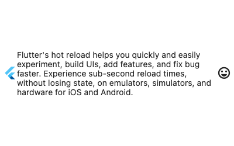

> [!Reference]
> https://api.flutter.dev/flutter/widgets/Row-class.html

### Row在Flutter中表示為水平配置框
#### Row屬性：
- 一個在水平排列中顯示其子級的Widget。
- 若要使子級展開以填滿可用的水平空間，請將子級包裹在 Expanded 中。
- Row Widgets不會滾動（通常，行中的子項數量超過可用空間的數量會被視為錯誤）。如果您有一排Widgets，並且希望它們能夠在空間不足的情況下捲動，請考慮使用 ListView。
- 若要查看垂直排列的變體，請參閱 Column。
- 如果只有一個子級，可以考慮使用 Align 或 Center 來定位該子級。

#### Example:
```Dart linenums="1"
const Row(
  children: <Widget>[
    Expanded(
      child: Text('Deliver features faster', textAlign: TextAlign.center),
    ),
    Expanded(
      child: Text('Craft beautiful UIs', textAlign: TextAlign.center),
    ),
    Expanded(
      child: FittedBox(
        child: FlutterLogo(),
      ),
    ),
  ],
)
```

---

### 使用中會遇到的問題
- 如果出現像以下的黃黑色樣式

出現原因主要是物件"溢出"畫面造成的，由於位將Row設定有Expanded或Flexible的Widgets因此導致過多物件或過長，而溢出畫面
- 出現原因例如：
```Dart linenums="1"
const Row(
  children: <Widget>[
    FlutterLogo(),
    Text("Flutter's hot reload helps you quickly and easily experiment, build UIs, add features, and fix bug faster. Experience sub-second reload times, without losing state, on emulators, simulators, and hardware for iOS and Android."),
    Icon(Icons.sentiment_very_satisfied),
  ],
)
```

#### 解決方式：
1. 使用Expanded

```Dart linenums="1"
const Row(
  children: <Widget>[
    FlutterLogo(),
    Expanded(
      child: Text("Flutter's hot reload helps you quickly and easily experiment, build UIs, add features, and fix bug faster. Experience sub-second reload times, without losing state, on emulators, simulators, and hardware for iOS and Android."),
    ),
    Icon(Icons.sentiment_very_satisfied),
  ],
)
```



---

### 常見的Row參數：

1. **children**：接受一個 Widget 列表，這些 Widget 是 Row 中的子元素。

2. **mainAxisAlignment**：決定子元素在主軸（水平軸）上的對齊方式，可以是以下之一：
   - MainAxisAlignment.start：子元素靠主軸的起始位置對齊。
   - MainAxisAlignment.end：子元素靠主軸的結束位置對齊。
   - MainAxisAlignment.center：子元素在主軸上居中對齊。
   - MainAxisAlignment.spaceBetween：平均分配主軸上的空間，使子元素之間的間距相等。
   - MainAxisAlignment.spaceAround：平均分配主軸上的空間，使子元素之間和兩邊的間距都相等。
   - MainAxisAlignment.spaceEvenly：平均分配主軸上的空間，使所有間距都相等。

3. **crossAxisAlignment**：決定子元素在交叉軸（垂直軸）上的對齊方式，可以是以下之一：
   - CrossAxisAlignment.start：子元素靠交叉軸的起始位置對齊。
   - CrossAxisAlignment.end：子元素靠交叉軸的結束位置對齊。
   - CrossAxisAlignment.center：子元素在交叉軸上居中對齊。
   - CrossAxisAlignment.stretch：子元素在交叉軸上拉伸以填滿可用空間。

4. **mainAxisSize**：決定 Row 在主軸上的大小，可以是以下之一：
   - MainAxisSize.max：Row 將盡量擴展以填滿可用的主軸空間。
   - MainAxisSize.min：Row 將縮小以適應其子元素的大小。

5. **textDirection**：決定 Row 中文本的方向，可以是 TextDirection.ltr（從左到右）或 TextDirection.rtl（從右到左）。

6. **verticalDirection**：決定 Row 中子元素的排列方向，可以是 VerticalDirection.down（自上而下）或 VerticalDirection.up（自下而上）。

```Dart linenums="1"
Row(
    {Key? key, 
    MainAxisAlignment mainAxisAlignment = MainAxisAlignment.start, 
    MainAxisSize mainAxisSize = MainAxisSize.max, 
    CrossAxisAlignment crossAxisAlignment = CrossAxisAlignment.center, 
    TextDirection? textDirection, 
    VerticalDirection verticalDirection = VerticalDirection.down, 
    TextBaseline? textBaseline, 
    List<Widget> children = const <Widget>[]})
```

在查看Flutter官方的內容時請注意查看`Properties`此項目

> [!Attention]
> Column跟Row用法很像，主要區別在Column式針對垂直的畫面編排，而Row則是水平的。