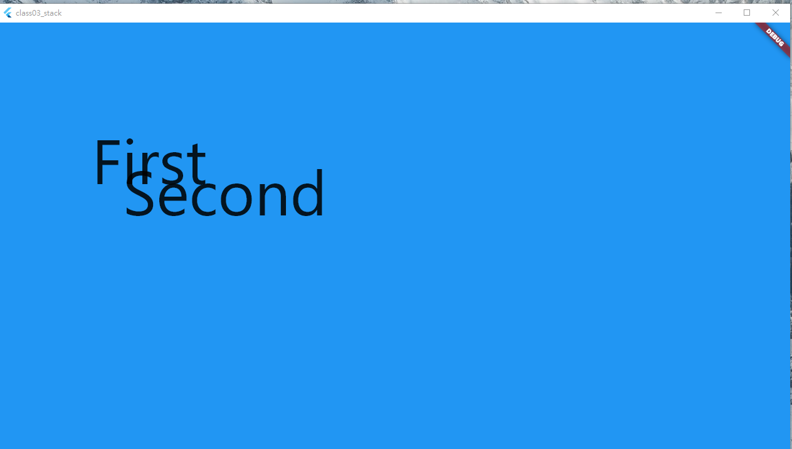

### Stack?
- 一個將其子項相對於其框的邊緣定位的Widgets。
- 如果您想以簡單的方式`重疊多個子項`，例如使用一些文字和圖像，覆蓋漸變並在底部附加一個按鈕，則此類非常有用。
- Stack將自動調整大小以容納其未定位的子元素。您可以使用Stack的屬性來自定義對齊方式，以及使用Positioned小部件來指定特定子元素的位置。
- 子元素可能會超出 Stack 的範圍，您可以使用 overflow 屬性來控制是否允許超出範圍或裁剪子元素。

### 可調參數
```Dart linenums="1"
(new) Stack Stack({
  Key? key,
  AlignmentGeometry alignment = AlignmentDirectional.topStart,
  TextDirection? textDirection,
  StackFit fit = StackFit.loose,
  Clip clipBehavior = Clip.hardEdge,
  List<Widget> children = const <Widget>[],
})
```

### Example

```Dart linenums="1"
Stack(
        alignment: Alignment.center, // 子小部件在Stack中居中對齊
        fit: StackFit.expand, // 子小部件佔滿Stack區域
        textDirection: TextDirection.ltr,
        children: <Widget>[
          Container(
            width: 50,
            height: 50,
            color: Colors.blue,
          ),
          Positioned(
            top: 150,
            left: 150,
            child: Text(
              'First',
              style: TextStyle(fontSize: 100),
            ),
          ),
          Positioned(
            top: 200,
            left: 200,
            child: Text(
              'Second',
              style: TextStyle(fontSize: 100),
            ),
          )
        ], // 文本方向從左到右))
      )
```
