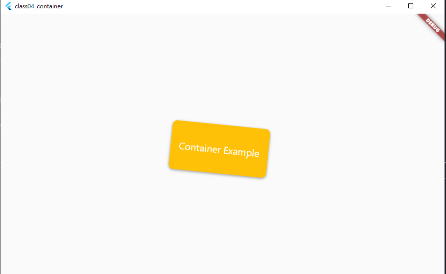

### Container

### 可調參數
```Dart linenums="1"
(new) Container Container({
  Key? key,
  AlignmentGeometry? alignment,
  EdgeInsetsGeometry? padding,
  Color? color,
  Decoration? decoration,
  Decoration? foregroundDecoration,
  double? width,
  double? height,
  BoxConstraints? constraints,
  EdgeInsetsGeometry? margin,
  Matrix4? transform,
  AlignmentGeometry? transformAlignment,
  Widget? child,
  Clip clipBehavior = Clip.none,
})
```

### Example
```Dart linenums="1"
Container(
          alignment: Alignment.center,
          padding: EdgeInsets.all(16.0),
          decoration: BoxDecoration(
            color: Colors.amber,
            borderRadius: BorderRadius.circular(10.0),
            boxShadow: [
              BoxShadow(
                color: Colors.grey,
                offset: Offset(0, 2),
                blurRadius: 4.0,
              ),
            ],
          ),
          width: 200.0,
          height: 100.0,
          margin: EdgeInsets.all(8.0),
          transform: Matrix4.rotationZ(0.1),
          child: Text(
            'Container Example',
            style: TextStyle(
              color: Colors.white,
              fontSize: 20.0,
            ),
          ),
          clipBehavior: Clip.hardEdge,
        ),
```


