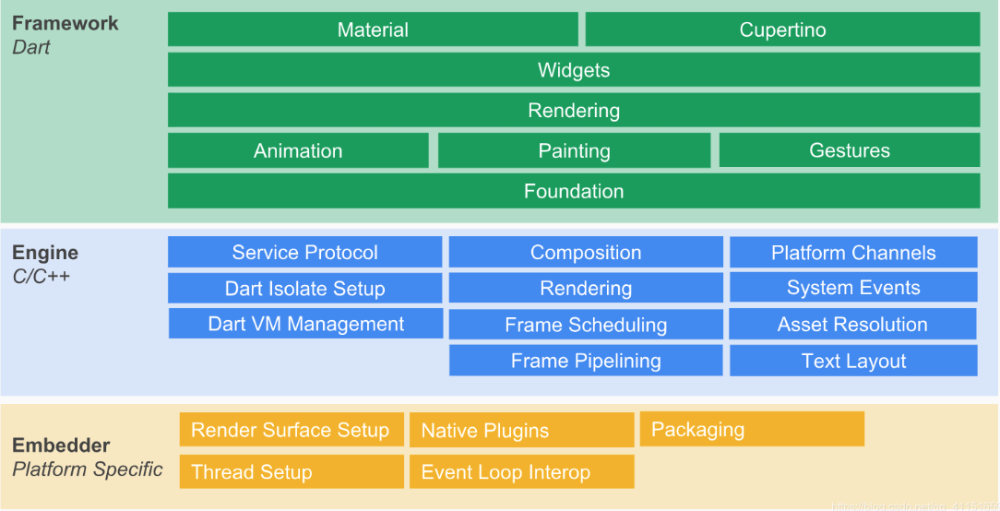

> [!Reference]
> https://www.liujunmin.com/flutter/material_app.html
## Flutter整體結構圖


#### Flutter Framework

+   Foundation、Animation、Painting、Gestures被合成了一個Dart UI層，對應的是Flutter中 `dart:ui` 包，是Flutter引擎暴露的底層UI庫，主要提供動畫、手勢、繪制能力。
+   Rendering層是一個抽象布局層，依賴於Dart UI層，Rendering層會構建一個UI樹、當UI樹有變化時，會計算出有變化的部分，然後更新UI樹，最終繪制在屏幕上
+   Widgets層是Flutter提供的一套基礎組件庫
+   Material、Cupertino是Flutter提供了兩種視覺風格的組件庫（Android、iOS)
    
    #### Flutter Engine
    
    這是一個純C++實現的SDK，主要執行相關的渲染、線程管理、平台事件等操作。其中包括了Skia引擎、Dart運行時、文字排版引擎等。在調用`dart:ui`庫是，其實最終會走到Engine層，實現真正的繪制邏輯.
    
    #### Flutter Embedder
    
    提供四個Task Runner，將引擎一直到平台中間層代碼的渲染設置、原生插件、打包、線程管理、時間循環、交互操作等。
    
+   UI Runner 負責綁定渲染相關操作
+   GPU Runner 用戶執行GPU指令
+   iOS Runner 處理圖片數據、為GPU做準備的
+   Platform Runner 所有接口調用都使用該接口
    
    ## 示例代碼
    

本文中很多效果都沒有截圖，可下載源代碼運行項目 [源代碼地址](https://github.com/JunAILiang/flutter_code)，或者通過視頻教程查看 [視頻教程地址](https://www.bilibili.com/video/BV1BM4y1L71Z?p=2)

## Material介紹

> Material 組件（MDC）幫助開發者實現 [Material Design](https://material.io/design)。MDC 由谷歌團隊的工程師和 UX 設計師創造，為 Android、iOS、Web 和 Flutter 提供很多美觀實用的 UI 組件。

## MaterialApp介紹

`MaterialApp` 包含了許多的 `Widget` ，這些 `Widget` 通常是實現 [Material Design](https://material.io/design) 的應用程序所必須要的，包含的 `Widget` 可以在 [Material Components widgets](https://flutter.dev/docs/development/ui/widgets/material) 中查看所有。 了解基本的概念，接下來我們詳細看一下 `MaterialApp` 具體怎麽使用。

#### Material屬性和說明

> 總共33個屬性

| **字段** | **屬性** | **描述** |
| --- | --- | --- |
| navigatorKey | GlobalKey | 導航鍵 |
| scaffoldMessengerKey | GlobalKey | 腳手架鍵 |
| home | Widget | 主頁，應用打開時顯示的頁面 |
| routes | Map<String, WidgetBuilder> | 應用程序頂級路由表 |
| initialRoute | String | 如果構建了導航器，則會顯示第一個路由的名稱 |
| onGenerateRoute | RouteFactory | 路由管理攔截器 |
| onGenerateInitialRoutes | InitialRouteListFactory | 生成初始化路由 |
| onUnknownRoute | RouteFactory | 當onGenerateRoute無法生成路由時調用 |
| navigatorObservers | List | 創建導航器的觀察者列表 |
| builder | TransitionBuilder | 在導航器上面插入小部件 |
| title | String | 程序切換時顯示的標題 |
| onGenerateTitle | GenerateAppTitle | 程序切換時生成標題字符串 |
| color | Color | 程序切換時應用圖標背景顏色（僅安卓有效） |
| theme | ThemeData | 主題顏色 |
| darkTheme | ThemeData | 暗黑模式主題顏色 |
| highContrastTheme | ThemeData | 系統請求“高對比度”使用的主題 |
| highContrastDarkTheme | ThemeData | 系統請求“高對比度”暗黑模式下使用的主題顏色 |
| themeMode | ThemeMode | 使用哪種模式的主題（默認跟隨系統） |
| locale | Locale | 初始區域設置 |
| localizationsDelegates | Iterable<LocalizationsDelegate\> | 本地化代理 |
| localeListResolutionCallback | LocaleListResolutionCallback | 失敗或未提供設備的語言環境 |
| localeResolutionCallback | LocaleResolutionCallback | 負責計算語言環境 |
| supportedLocales | Iterable | 本地化地區列表 |
| debugShowMaterialGrid | bool | 繪制基線網格疊加層（僅debug模式） |
| showPerformanceOverlay | bool | 顯示性能疊加 |
| checkerboardRasterCacheImages | bool | 打開柵格緩存圖像的棋盤格。 |
| checkerboardOffscreenLayers | bool | 打開渲染到屏幕外位圖的層的棋盤格。 |
| showSemanticsDebugger | bool | 打開顯示可訪問性信息的疊加層 |
| debugShowCheckedModeBanner | bool | 調試顯示檢查模式橫幅 |
| shortcuts | Map<LogicalKeySet, Intent> | 應用程序意圖的鍵盤快捷鍵的默認映射。 |
| actions | Map<Type, Action\> | 包含和定義用戶操作的映射 |
| restorationScopeId | String | 應用程序狀態恢覆的標識符 |
| scrollBehavior | ScrollBehavior | 可滾動小部件的行為方式 |

## 構造函數

##### 創建一個MaterialApp

> MaterialApp(…)

##### 創建一個使用 Router 而不是 Navigator 的 MaterialApp

> MaterialApp.router(…)

## 屬性詳解

### 1、navigatorKey

`navigatorKey` 相當於 `Navigator.of(context)` ，如果應用程序想實現無 `context` 跳轉，那麽可以通過設置該key, 通過 `navigatorKey.currentState.overlay.context` 獲取全局context。

#### 使用方法

```Dart linenums="1"
GlobalKey<NavigatorState> _navigatorKey = GlobalKey();

MaterialApp(
  navigatorKey: _navigatorKey,
);

```
### 2、scaffoldMessengerKey

`scaffoldMessengerKey` 主要是管理後代的 `Scaffolds`，可以實現無 `context` 調用 `snack bars`

#### 使用方法

```Dart linenums="1"
GlobalKey<ScaffoldMessengerState> _scaffoldKey = GlobalKey();

MaterialApp(
  scaffoldMessengerKey: _scaffoldKey,
);

_scaffoldKey.currentState.showSnackBar(SnackBar(content: Text("show SnackBar")));

```

### 3、home

程序進入後的第一個界面，傳入一個 `Widget`

##### 使用方法

```Dart linenums="1"
...
MaterialApp(
  home: Scaffold(...),
);
...
```

### 4、routes

生成路由表，以鍵值對形式傳入 `key` 為路由名字， `value` 為對應的`Widget`

##### 使用方法

```Dart linenums="1"
MaterialApp(
  routes: {
    "/home": (_) => Home(),
    "/my": (_) => My()
    //....
  },
);
```

### 5、initialRoute

初始路由，如果設置了該參數並且在 `routes` 找到了對應的key，將會展示對應的 `Widget` ，否則展示 `home`

##### 使用方法

```Dart linenums="1"
MaterialApp(
   routes: {
     "/home": (_) => Home(),
     "/my": (_) => My()
   },
   initialRoute: "/home",
 )
```

### 6、onGenerateRoute

當跳轉路由時，如果在 `routes` 找不到對應的 `key` ，會執行該回調，會調用會返回一個 `RouteSettings` ，該對象中有 `name` 路由名稱、 `arguments` 路由參數。

##### 使用方法

```Dart linenums="1"
MaterialApp(
   routes: {
     "/home": (_) => Home(),
     "/my": (_) => My()
     },
   initialRoute: "/home",
   onGenerateRoute: (setting) {
     // 这里可以做进一步的逻辑处理
     return MaterialPageRoute(builder: (_) => Home());
   },
)
```

### 7、onGenerateInitialRoutes

如果提供了 `initialRoute` ，則用於生成初始路由的路由生成器回調，如果未設置此屬性，則底層 [Navigator.onGenerateInitialRoutes](http://navigator.ongenerateinitialroutes/) 將默認為 [Navigator.defaultGenerateInitialRoutes](https://api.flutter.dev/flutter/widgets/Navigator/defaultGenerateInitialRoutes.html)。

##### 使用方法

```Dart linenums="1"
MaterialApp(
  initialRoute: "/home",
  onGenerateInitialRoutes: (initialRoute) {
    return [
      MaterialPageRoute(builder: (_) => Home()),
      MaterialPageRoute(builder: (_) => My()),
    ];
  }
 )
```

### 8、onUnknownRoute

效果和 `onGenerateRoute` 一樣，只是先走 `onGenerateRoute` ，如果無法生成路由時則在調用 `onUnknownRoute` 。

##### 使用方法

```Dart linenums="1"
MaterialApp(
   routes: {
     "/home": (_) => Home(),
     "/my": (_) => My()
     },
   initialRoute: "/home",
   onGenerateRoute: (setting) {
     return null;
   },
   onUnknownRoute: (setting) {
     return MaterialPageRoute(builder: (_) => Home());
   },
)
```

### 9、navigatorObservers

路由監聽器，主要是就是監聽頁面路由堆棧的變化，當頁面進行 `push` `pop` `remove` `replace` 等操作時會進行監聽。

##### 使用方法

```Dart linenums="1"
MaterialApp(
 	navigatorObservers: [
    MyObserver()
  ],
)
  
 class MyObserver extends NavigatorObserver {
  @override
  void didPush(Route route, Route previousRoute) {
    print(route);
    print(previousRoute);
    super.didPush(route, previousRoute);
  }
}
```

### 10、builder

當構建 `Widget` 前調用，主要用於字體大小、主題顏色等配置

##### 使用方法

```Dart linenums="1"
MaterialApp(
   routes: {
     "/home": (_) => Home(),
     "/my": (_) => My()
     },
   initialRoute: "/home",
   onGenerateRoute: (setting) {
     return null;
   },
   onUnknownRoute: (setting) {
     return MaterialPageRoute(builder: (_) => Home());
   },
 	 builder: (_, child) {
     return Scaffold(appBar: AppBar(title: Text("build")), body: child,);
   },
)
```

### 11、title

Android：任務管理器的程序快照之上 IOS: 程序切換管理器中

##### 使用方法

```Dart linenums="1"
MaterialApp(
   title: 'Flutter应用',
 );
``` 

### 12、onGenerateTitle

如果非空，則調用此回調函數以生成應用程序的標題字符串，否則會使用 `title` 。每次重建頁面是該方法就會回調執行。

##### 使用方法

```Dart linenums="1"
MaterialApp(
   title: 'Flutter应用',
   onGenerateTitle: (_) {
     return "我的天";
   },
 );
``` 

### 13、color

設置該值的在程序切換時應用圖標的背景顏色，當應用圖標為透明時。

##### 使用方法

```Dart linenums="1"
MaterialApp(
  color: Colors.blue,
)
``` 

### 14、theme

如果指定了 `darkTheme` ，那麽用於提供用戶界面的深色版本。如果提供了 `darkTheme` ， `themeMode` 將控制將使用哪個主題。默認值是 `ThemeData.light()` 應用程序的主題顏色

##### 使用方法

```Dart linenums="1"
MaterialApp(
  theme: ThemeData(
    // 主要颜色
    primaryColor: Colors.red
  ),
)
``` 

### 15、darkTheme

應用程序深色主題顏色

##### 使用方法

```Dart linenums="1"
MaterialApp(
  theme: ThemeData(
    // 主要颜色
    primaryColor: Colors.red
  ),
)
```

### 16、highContrastTheme

當系統請求“高對比度”時使用的 `ThemeData` ，當該值為空時會用 `theme` 應用該主題

##### 使用方法


```Dart linenums="1"
MaterialApp(
  highContrastTheme: ThemeData(
    primaryColor: Colors.pink
  ),
)
```


### 17、highContrastDarkTheme

當系統再暗黑模式下請求“高對比度”時使用的 `ThemeData` ，當該值為空時會用 `darkTheme` 應用該主題。

##### 使用方法

```Dart linenums="1"
MaterialApp(
  highContrastDarkTheme: ThemeData(
    primaryColor: Colors.green
  ),
)
```

### 18、themeMode

白天模式和暗黑模式模式切換，默認值為 `ThemeMode.system`

##### 使用方法

```Dart linenums="1"
MaterialApp(
  themeMode: ThemeMode.dark
)
```

### 19、locale

主要用於語言切換時，如果為 `null` 時使用系統區域

##### 使用方法

```Dart linenums="1"
MaterialApp(
  locale: Locale('zh', 'CN') // 中文简体
)
```

### 20、localizationsDelegates

本地化委托

##### 使用方法

```Dart linenums="1"
MaterialApp(
  locale: Locale('zh', 'TW') // 中文简体
  localizationsDelegates: [
    GlobalMaterialLocalizations.delegate,
    GlobalWidgetsLocalizations.delegate,
  ],
)
```

### 21、supportedLocales

當前應用支持的 `Locale` 列表

##### 使用方法

```Dart linenums="1"
MaterialApp(
  locale: Locale('zh', 'TW'), 
  supportedLocales: [
    Locale('en', 'US'), //美国英语
    Locale("zh", 'TW'), 
  ],
  localeListResolutionCallback: (List<Locale> locales, Iterable<Locale> supportedLocales) {
    // 系统切换语言时调用
    return Locale("zh", 'TW');
  },
)
```

### 22、localeListResolutionCallback

監聽系統語言切換事件，一些安卓系統特性，可設置多語言列表，默認以第一個列表為默認語言

##### 使用方法

```Dart linenums="1"
MaterialApp(
  locale: Locale('zh', 'TW'), // 中文简体
  supportedLocales: [
    Locale('en', 'US'), //美国英语
    Locale("zh", 'TW'), //中文简体
  ],
  localeResolutionCallback: (Locale locale, Iterable<Locale> supportedLocales) {
    return Locale("zh", 'TW');
  },
)
```
### 23、localeResolutionCallback

監聽系統語言切換事件

##### 使用方法

```Dart linenums="1"
MaterialApp(
  locale: Locale('zh', 'TW'), // 中文简体
  supportedLocales: [
    Locale('en', 'US'), //美国英语
    Locale("zh", 'TW'), //中文简体
  ],
  localeResolutionCallback: (Locale locale, Iterable<Locale> supportedLocales) {
    return Locale("zh", 'TW');
  },
)
```

### 24、debugShowMaterialGrid

在 `debug` 模式下展示基線網格

##### 使用方法

```Dart linenums="1"
MaterialApp(
  debugShowMaterialGrid: true
)
```

### 25、showPerformanceOverlay

顯示性能疊加，開啟此模式主要用於性能測試

##### 使用方法

```Dart linenums="1"
MaterialApp(
  showPerformanceOverlay: true
)
```

### 26、checkerboardRasterCacheImages

打開柵格緩存圖像的棋盤格

##### 使用方法

```Dart linenums="1"
MaterialApp(
  checkerboardRasterCacheImages: true
)
```

### 27、checkerboardOffscreenLayers

打開渲染到屏幕外位圖的層的棋盤格

##### 使用方法

```Dart linenums="1"
MaterialApp(
  checkerboardOffscreenLayers: true
)
```

### 28、showSemanticsDebugger

打開顯示可訪問性信息的疊加層，展示組件之間的關系、占位大小

##### 使用方法

```Dart linenums="1"
MaterialApp(
  showSemanticsDebugger: true
)
```

### 29、debugShowCheckedModeBanner

調試顯示檢查模式橫幅

##### 使用方法

```Dart linenums="1"
MaterialApp(
  debugShowCheckedModeBanner: false
)
```

### 30、shortcuts以及actions

`shortcuts` 和 `actions` 是將物理鍵盤事件綁定到用戶界面中的操作。 比如，要在您的應用程序中定義鍵盤快捷鍵，這里不做過多的描述，後面我會專門拿一個專題來講解。

### 31、restorationScopeId

定義一個應用程序狀態恢覆的標識符，提供標識符會將 [RootRestorationScope](https://api.flutter.dev/flutter/widgets/RootRestorationScope-class.html) 插入 `widget` 層次結構，從而為後代 `widget` 啟用狀態恢覆。還可以通過標識符使 `WidgetsApp` 構建的導航器恢覆其狀態（即恢覆活動路由的歷史堆棧），由於這里涉及的內容較多，後面會專門拿一個專題來講解。

### 32、scrollBehavior

統一滾動行為設置，設置後子組件將返回對應的滾動行為

##### 使用方法

```Dart linenums="1"
MaterialApp(
  scrollBehavior: ScrollBehaviorModified()
)
  
class ScrollBehaviorModified extends ScrollBehavior {
  const ScrollBehaviorModified();
  @override
  ScrollPhysics getScrollPhysics(BuildContext context) {
    switch (getPlatform(context)) {
      case TargetPlatform.iOS:
      case TargetPlatform.macOS:
      case TargetPlatform.android:
        return const BouncingScrollPhysics();
      case TargetPlatform.fuchsia:
      case TargetPlatform.linux:
      case TargetPlatform.windows:
        return const ClampingScrollPhysics();
    }
    return null;
  }
}

```