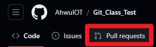

### 在這你必須學會
- [ ] 如何在fork完別人的Repository後於本地端修改完檔案內容，在執行`pull request`
- [ ] 了解如何整併自己與其他人的內容。
- [ ] 獲得github徽章

### 執行步驟
1. 到以下網址:https://github.com/AhwuIOT/Git_Class_Test.git
2. fork以上Repo
3. 打開VSCode利用終端機到想存放資料的資料夾下`cd 想到的資料夾`
4. 請在終端機輸入以下指令`git clone https://github.com/你的Github帳號/Git_Class_Test.git`
5. 拷貝下來的Repo使用VSCode打開
6. 請建立一個名為`Git+你的座號.md`的檔案
7. 請在此md檔中輸入以下文字，並保存

```
All things are difficult before they are easy.
```

8. 請點選VSCode左手邊的
9. 此處可以用來執行git commit及git push和git相關指令
10. 請建立一個`test`分支，並切換至此分支
11. 請將檔案push至github，並至github網頁檢查是否有正確上傳
12. 請至:https://github.com/你的帳號/Git_Class_Test.git
13. 請到此頁面，爾後請建立pull request