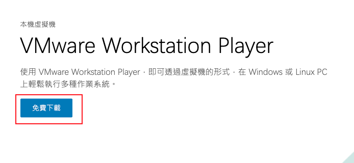

### 在這你必須學會
- [ ] 安裝虛擬機
- [ ] 在虛擬機上安裝Ubuntu
- [ ] 了解Ubuntu的操作方式
- [ ] 了解Linux與Windows的差別

---

### 執行步驟
#### 1.安裝虛擬機
1. 前往 [VMWARE 的官方網站](https://www.vmware.com/tw/products/workstation-player.html)並下載Workstation Player。

2. 執行安裝程式並按照提示完成安裝。

---

#### 在虛擬機上安裝Ubuntu
1. 前往 Ubuntu 的官方網站（https://ubuntu.com/download/desktop）下載最新版本的桌面版 ISO 檔。
2. 打開 VMWare WorkStationPlayer，點擊 "新建" 創建一個新的虛擬機。
3. 設定虛擬機名稱、類型（選擇 "Linux"）、版本（選擇 "Ubuntu"）。
4. 配置記憶體大小和虛擬硬碟。
5. 在虛擬機設定中，選擇 "存儲"，然後加入先前下載的 Ubuntu ISO 檔。
6. 啟動虛擬機並按照 Ubuntu 的安裝提示進行。

> [!Attention]
> 以上過程請跟隨老師，或參考 https://www.kjnotes.com/linux/18

---

#### 了解Ubuntu的操作方式
- Basic 💬
1. 桌面環境：Ubuntu 預設使用 GNOME 桌面環境，其操作方式和 Windows 有些差異，但基本的窗口操作是相似的。
2. 終端機：在 Ubuntu 中，終端機是一個非常有用的工具，您可以使用它來執行命令、安裝軟體等。

---

#### 了解Linux與Windows的差別
1. 核心設計：Linux 是一種開放源碼的操作系統，而 Windows 是商業軟體。
2. 使用者權限：Linux 有較為嚴格的使用者和權限系統，這使得 Linux 在安全性方面有優勢。
3. 軟體安裝：在 Windows 上，用戶通常下載 .exe 或 .msi 安裝程式；而在 Linux 上，軟體多數通過包管理器（如 apt, yum）來安裝。
4. 用戶界面：Linux 提供多種桌面環境，如 GNOME、KDE 等，而 Windows 則有其獨特的用戶界面。
5. 遊戲和軟體兼容性：雖然 Linux 的遊戲和軟體市場逐漸成熟，但 Windows 仍然是大多數主流遊戲和軟體的首選平台。

---

#### 一些GUI介面的內容
1. Linux的記事本
2. Linux的設定（EX：網路、語言、時間）

---
