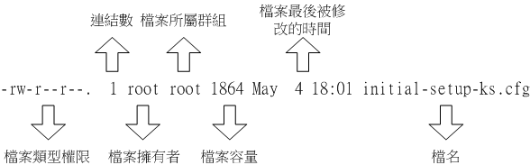
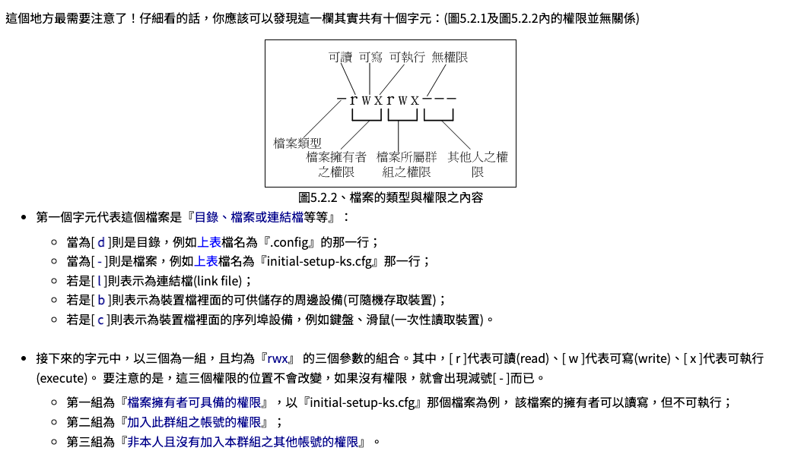

### 在這你必須學會
- [ ] Linux的檔案存取權限限制
- [ ] 指令`chmod`,`chgrp`,`chown`

### 執行步驟

- 檢視此資料夾下檔案及其權限。

```bash
ls -l
```

- 權限的意義


參考：https://linux.vbird.org/linux_basic/centos7/0210filepermission.php

> [!Reference]
> 可參考：https://linmingwei.gitbooks.io/-linux/content/chapter1/di-5-tang-ke-ff1a-quan-xian-ying-yong-3001-cheng-xu-zhi-guan-cha-yu-ji-ben-guan-li.html

#### 
| 指令       | 描述   | 範例用法       |
|------------|-----------|-------------|
| `chmod`    | 改變文件或目錄的權限。      | `chmod 755 filename` (設置文件權限為rwxr-xr-x)                 |
| `chgrp`    | 改變文件或目錄的群組。            | `chgrp groupname filename` (將文件的群組設置為groupname)         |
| `chown`    | 改變文件或目錄的所有者。它可以同時改變擁有者和群組，或只改變其中之一。    | `chown username filename` (改變文件所有者為username) 或 `chown username:groupname filename` (同時改變所有者和群組) |
