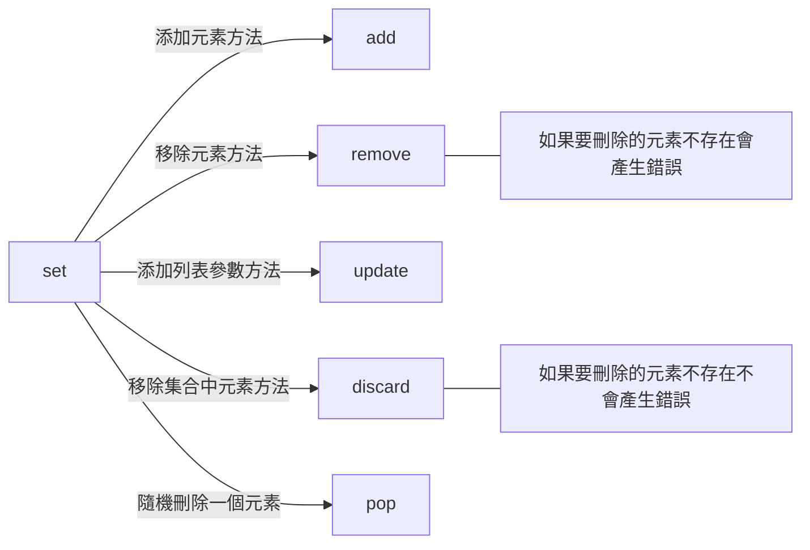

在Python中，Set是一種無序、不可重複的集合資料型態。它可使用花括號{}表示，並且可以用於存儲不同的元素，並提供一些集合操作的功能。以下是Set的用法及一些範例：

1. 建立Set：
   你可以使用花括號（{}）或set()函數來建立Set。例如：
   ```python
   my_set = {1, 2, 3, 4, 5}  # 使用花括號建立Set
   my_set = set([1, 2, 3, 4, 5])  # 使用set()函數建立Set
   ```

2. Set的特性：
   - ==Set中的元素是唯一的，不會重複。==
   - Set中的元素是無序的，無法使用索引訪問。
   - Set中的元素可以是不可變的（例如數字、字串、元組），但不能是可變的（例如列表、字典）。

3. 基本操作：
   - 添加元素：使用add()方法添加元素到Set中。例如：
     ```python
     my_set.add(6)  # 添加元素6到Set中
     ```

   - 刪除元素：使用remove()方法從Set中刪除指定的元素。如果元素不存在，會引發KeyError。另一種選擇是使用discard()方法，它也可以刪除元素，但如果元素不存在，不會引發錯誤。例如：
     ```python
     my_set.remove(2)  # 刪除元素2
     ```

   - 檢查元素是否存在：使用in運算子檢查Set中是否存在指定元素。例如：
     ```python
     if 3 in my_set:
         print("元素3存在於Set中")
     ```
---


4. 集合運算：
   Set提供了各種集合運算操作，如聯集、交集、差集等。
   - 聯集：使用union()方法或|運算子獲取兩個Set的聯集。例如：
     ```python
     set1 = {1, 2, 3}
     set2 = {3, 4, 5}
     union_set = set1.union(set2)
     # 或使用運算子
     union_set = set1 | set2
     ```

   - 交集：使用intersection()方法或&運算子獲取兩個Set的交集。例如：
     ```python
     set1 = {1, 2, 3}
     set2 = {3, 4, 5}
     intersection_set = set1.intersection(set2)
     # 或使用運算子
     intersection_set = set1 & set2
     ```

   - 差集：使用difference()方法或-運算子獲取兩個Set的差集。例如：
     ```python
     set1 = {1, 2, 3}
     set2 = {3, 4, 5}
     difference_set = set1.difference(set2)
     # 或使用運算子
     difference_set = set1 - set2
     ```

   - 對稱差集：使用symmetric_difference()方法或^運算子獲取兩個Set的對稱差集。例如：
     ```python
     set1 = {1, 2, 3}
     set2 = {3, 4, 5}
     symmetric_difference_set = set1.symmetric_difference(set2)
     # 或使用運算子
     symmetric_difference_set = set1 ^ set2
     ```

這些是Set在Python中的一些基本用法及範例。使用Set可以方便地處理集合相關的操作，同時確保元素的唯一性。

- Reference
	- [[Python 704 集合條件判斷]]
