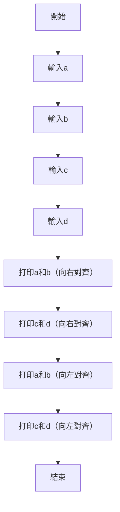

#Python #String #TQC 
#### 題目說明：

請撰寫一程式，輸入四個整數，然後將這四個整數以欄寬為5、欄與欄間隔一個空白字元，再以每列印兩個的方式，先列印向右靠齊，再列印向左靠齊，左右皆以直線 |（Vertical bar）作為邊界。

#### 範例輸入

```
85
4
299
478
```

#### 範例輸出

```
|   85     4|
|  299   478|
|85    4    |
|299   478  |
```

---
#### Solution
```python linenums="1"
a = input()
b = input()
c = input()
d = input()
print("|{:>5s} {:>5s}|".format(a, b))
print("|{:>5s} {:>5s}|".format(c, d))
print("|{:<5s} {:<5s}|".format(a, b))
print("|{:<5s} {:<5s}|".format(c, d))
```


### Mermaid 流程圖




- Reference
	- [TQC+ 程式語言Python 101 整數格式化輸出](https://jbprogramnotes.com/2020/05/tqc-%e7%a8%8b%e5%bc%8f%e8%aa%9e%e8%a8%80python-101-%e6%95%b4%e6%95%b8%e6%a0%bc%e5%bc%8f%e5%8c%96%e8%bc%b8%e5%87%ba/)
