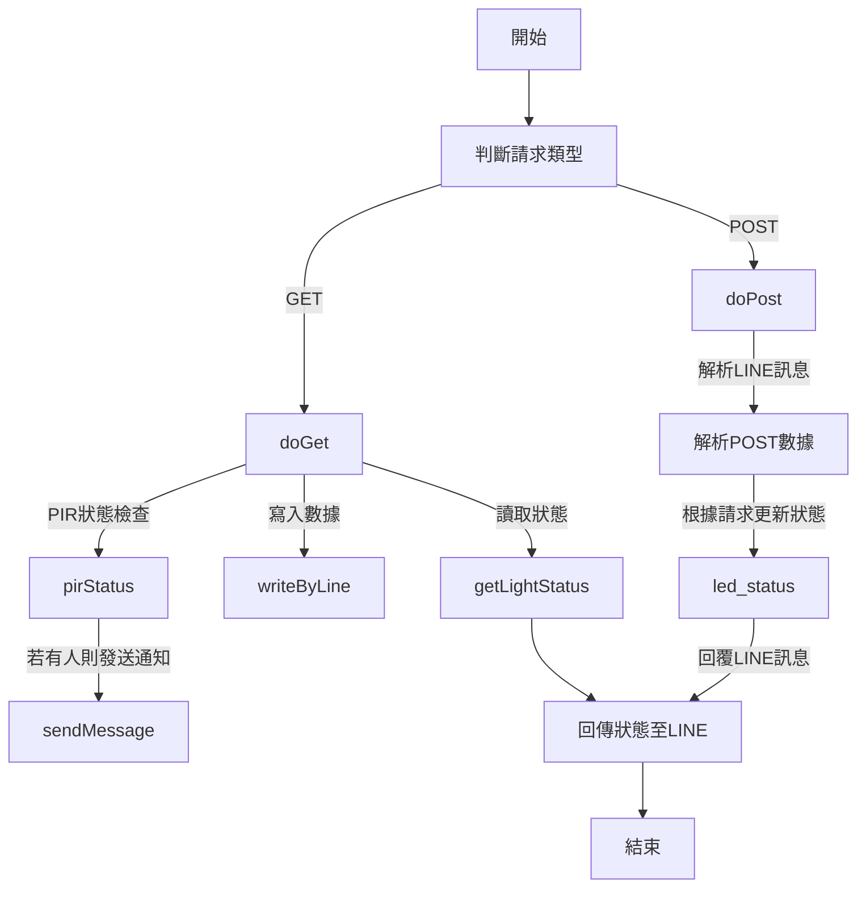

這段 Google App Script 程式碼的主要功能包括處理來自 HTTP GET 和 POST 請求的數據，並與 Google Sheets 進行交互。它還與 LINE Messaging API 進行通訊，用於接收指令並回覆消息。以下是各個函數的具體功能和流程：

### 函數和流程

1. **writeByLine 函數**：接收 HTTP GET 請求的參數，如果參數有效，則將數據寫入指定的 Google Sheets 單元格。

2. **led_status 函數**：將特定的數據（例如 "ON" 或 "OFF"）寫入 Google Sheets 的 A1 單元格，用於控制 LED 狀態。

3. **getLightStatus 函數**：從 Google Sheets 的 A1 單元格讀取 LED 的當前狀態。

4. **doGet 函數**：處理 HTTP GET 請求，獲取 LED 狀態，寫入新的數據到 Google Sheets，並根據 PIR 傳感器狀態發送消息。

5. **pirStatus 函數**：從 Google Sheets 的 B1 單元格獲取 PIR 傳感器的狀態。

6. **doPost 函數**：處理來自 LINE 的 POST 請求。根據用戶發送的消息更新 LED 狀態（例如，如果收到 "要求開燈"，則打開 LED），並通過 LINE API 發送回應。

7. **sendMessage 函數**：向 LINE 的指定用戶或群組發送消息。

### Mermaid 流程圖

這個流程圖展示了整個腳本如何根據不同的 HTTP 請求來處理數據，以及如何與 Google Sheets 和 LINE API 進行交互。您可以將這段 Mermaid 語法複製到支持 Mermaid 的編輯器中，以生成對應的流程圖。