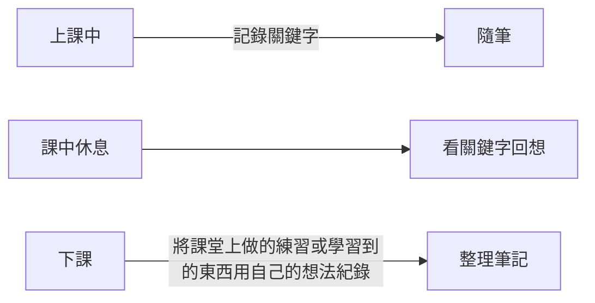

## 為何花了很多時間在學習，但實際在操作時卻還是感覺很卡?

- 一直重複並不一定能帶來記憶效果，重點在於實際操作時當下是否具有【意識】
- 一天學習的內容那麼多，重投到尾再看一次是最沒效益的，應該在每節下課的時候去回想【老師說了什麼】、【這節課到底教了什麼】、【學到的這個程式碼是可以用在哪個地方】

## 你可能有的一些想法

- 程式碼是一個很複雜的東西，不僅要會英文，還要會數學，真是太難了，我這兩個都不好，還能學嗎?
- 程式碼到底是在做什麼?有短時間內就速成的方式嗎?

## 筆記

- 上課不一定要記筆記，但下課休息時一定要回想，就跟上班時主管交辦任務一樣，你在當下不一定有那麼多時間去紀錄，等主管口頭交辦完，前面說的話你可能在後面就忘了，該怎麼辦?
    - 只記關鍵字
    - 上課可以螢幕截圖
    - 課堂筆記不需要太美觀，它是用來幫助你記憶，而不是用來審美
    - 使用心智圖筆記法

## 【整理筆記】要點

- 絕對不是將老師上課的內容直接複製貼上，而是…
    - 你認為這個程式碼它的作用是做什麼?
    - 如果是你的話你會把它用在哪裡?
    - 你要怎麼去實踐你認為的想法?
    - **你實踐了嗎**?
## 艾賓浩斯遺忘曲線

****

---
